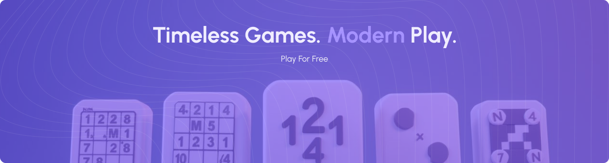

# Puzzroo

> **Timeless Games. Modern Play. Play For Free.**

A modern, production-ready landing page for Puzzroo - your ultimate puzzle gaming platform. Built with Next.js 14, TypeScript, and Tailwind CSS, featuring a stunning dark mode and fully responsive design.



## 🎯 Overview

Puzzroo is a comprehensive puzzle gaming platform offering classic games with a modern twist. This repository contains the marketing landing page showcasing our free puzzle games including Number Ninja, Crossword, Sudoku, Kakuro, Dots Match, and Nonogram.

## ✨ Features

- **🎨 Modern UI/UX Design** - Clean, intuitive interface with smooth animations
- **🌓 Dark Mode Support** - Seamless theme switching with persistent preferences
- **📱 Fully Responsive** - Mobile-first design optimized for all screen sizes
- **⚡ Performance Optimized** - Built with Next.js 14 App Router for blazing-fast performance
- **♿ Accessibility** - WCAG compliant with keyboard navigation support
- **🎭 Smooth Animations** - Polished transitions and hover effects
- **🔍 SEO Optimized** - Meta tags, Open Graph, and Twitter Card support
- **💪 TypeScript** - Type-safe development with full TypeScript support
- **🎨 Tailwind CSS** - Utility-first CSS framework for rapid development
- **📦 Modular Components** - Reusable, maintainable component architecture

## 🎮 Featured Games

- **Number Ninja** - Master the art of number puzzles
- **Crossword** - Challenge your vocabulary and word skills
- **Sudoku** - Classic logic-based number placement game
- **Kakuro** - Mathematical crossword puzzles
- **Dots Match** - Connect and match colorful dots
- **Nonogram** - Picture logic puzzles

## 🚀 Getting Started

### Prerequisites

- **Node.js** 18.x or higher
- **npm** or **yarn** or **pnpm**

### Installation

1. **Clone the repository**

```bash
git clone https://github.com/yourusername/puzzroo.git
cd puzzroo
```

2. **Install dependencies**

```bash
npm install
# or
yarn install
# or
pnpm install
```

3. **Run the development server**

```bash
npm run dev
# or
yarn dev
# or
pnpm dev
```

4. **Open your browser**

Navigate to [http://localhost:3000](http://localhost:3000) to see the application.

## 📁 Project Structure

```
puzzroo/
├── public/
│   ├── fonts/              # Custom Urbanist font files
│   ├── hero-image.svg      # Desktop hero image
│   ├── hero-mobile.png     # Mobile hero image
│   ├── logo-icon.svg       # Brand logo and favicon
│   └── [game-assets].svg   # Game card images
├── src/
│   ├── app/
│   │   ├── layout.tsx      # Root layout with metadata
│   │   ├── page.tsx        # Main landing page
│   │   ├── providers.tsx   # Theme provider wrapper
│   │   └── globals.css     # Global styles
│   ├── components/
│   │   ├── layout/
│   │   │   ├── Navbar.tsx  # Navigation with hamburger menu
│   │   │   └── Footer.tsx  # Footer with links
│   │   ├── sections/
│   │   │   ├── Hero.tsx    # Hero section
│   │   │   ├── FreeGames.tsx  # Game cards grid
│   │   │   ├── Features.tsx   # Premium features section
│   │   │   └── FAQ.tsx     # Accordion FAQ section
│   │   └── ui/
│   │       ├── button.tsx  # Reusable button component
│   │       └── badge.tsx   # Badge component
│   ├── data/
│   │   └── faq.ts          # FAQ content data
│   ├── hooks/
│   │   └── use-theme.ts    # Theme management hook
│   ├── lib/
│   │   └── utils.ts        # Utility functions and image exports
│   └── styles/
│       └── globals.css     # Additional global styles
├── .eslintrc.json          # ESLint configuration
├── next.config.js          # Next.js configuration
├── tailwind.config.ts      # Tailwind CSS configuration
├── tsconfig.json           # TypeScript configuration
└── package.json            # Dependencies and scripts
```

## 🛠️ Tech Stack

### Core
- **[Next.js 14](https://nextjs.org/)** - React framework with App Router
- **[React 18](https://react.dev/)** - UI library
- **[TypeScript](https://www.typescriptlang.org/)** - Type safety

### Styling
- **[Tailwind CSS](https://tailwindcss.com/)** - Utility-first CSS framework
- **[Urbanist Font](https://fonts.google.com/specimen/Urbanist)** - Modern sans-serif typeface

### Development Tools
- **[ESLint](https://eslint.org/)** - Code linting
- **[PostCSS](https://postcss.org/)** - CSS processing
- **clsx & tailwind-merge** - Conditional class management

## 🎨 Design Features

### Responsive Breakpoints
- **Mobile**: < 768px
- **Tablet**: 768px - 1024px
- **Desktop**: > 1024px

### Color Palette

#### Light Mode
- Background: `#FFFFFF`
- Secondary Background: `#F0EDFF`
- Text Primary: `#181A20`, `#424242`
- Accent: `#6949FF`

#### Dark Mode
- Background: `#181A20`
- Secondary Background: `#1F222A`
- Text Primary: `#FFFFFF`, `#FAFAFA`
- Accent: `#6949FF`

### Typography
- **Font Family**: Urbanist
- **Weights**: 300 (Light), 400 (Regular), 600 (SemiBold), 700 (Bold), 800 (ExtraBold)

## 📱 Sections Overview

### Hero Section
Full-width hero banner with responsive images for desktop and mobile views.

### Free Games Section
Grid layout showcasing 6 puzzle games with:
- Game preview images
- Game titles and status
- "Play Now" call-to-action buttons
- Responsive grid (2 columns mobile, 3 columns desktop)

### Features Section
Highlights premium membership benefits with:
- Desktop: Feature list grid with purple gradient box
- Mobile: Simplified layout with feature image

### FAQ Section
Interactive accordion with:
- One item open at a time
- Smooth expand/collapse animations
- Keyboard accessible
- Custom dropdown icons

### Navigation
Responsive navbar with:
- Brand logo and name
- Dark mode toggle
- Mobile hamburger menu
- Login/Sign up buttons

### Footer
Clean footer with:
- Copyright information
- Privacy Policy and Terms & Conditions links
- Consistent branding

## 🔧 Configuration

### Environment Variables

Create a `.env.local` file in the root directory:

```env
# Add your environment variables here
NEXT_PUBLIC_SITE_URL=https://puzzroo.com
NEXT_PUBLIC_GA_TRACKING_ID=your-ga-tracking-id
```

### Customization

#### Update Branding
Edit `src/lib/utils.ts` to update image paths and dimensions.

#### Modify Theme Colors
Edit `tailwind.config.ts` to customize color palette.

#### Update Content
- FAQ: Edit `src/data/faq.ts`
- Games: Modify `src/components/sections/FreeGames.tsx`

## 📦 Build & Deploy

### Production Build

```bash
npm run build
npm run start
```

### Deployment

This project can be deployed to:

- **[Vercel](https://vercel.com/)** (Recommended)
- **[Netlify](https://www.netlify.com/)**
- **[AWS Amplify](https://aws.amazon.com/amplify/)**
- Any Node.js hosting platform

#### Deploy to Vercel

```bash
npm install -g vercel
vercel
```

## 🧪 Development Scripts

```bash
# Start development server
npm run dev

# Build for production
npm run build

# Start production server
npm run start

# Run linting
npm run lint
```

## 🤝 Contributing

Contributions are welcome! Please follow these steps:

1. Fork the repository
2. Create a feature branch (`git checkout -b feature/amazing-feature`)
3. Commit your changes (`git commit -m 'Add amazing feature'`)
4. Push to the branch (`git push origin feature/amazing-feature`)
5. Open a Pull Request

## 📄 License

This project is licensed under the MIT License - see the [LICENSE](LICENSE) file for details.

## 👥 Authors

- **Puzzroo Team** - *Initial work*

## 🙏 Acknowledgments

- Design inspiration from modern gaming platforms
- Urbanist font by [Corey Hu](https://fonts.google.com/specimen/Urbanist)
- Icons and illustrations created for Puzzroo

## 📞 Contact & Support

- **Website**: [https://puzzroo.com](https://puzzroo.com)
- **Email**: support@puzzroo.com
- **Twitter**: [@puzzroo](https://twitter.com/puzzroo)

## 🔄 Changelog

### Version 1.0.0 (June 2026)
- ✨ Initial release
- 🎮 Six free puzzle games
- 🌓 Dark mode support
- 📱 Fully responsive design
- ♿ Accessibility improvements
- 🔍 SEO optimization

---

**Made with ❤️ by the Puzzroo Team | © 2026 Puzzroo. All rights reserved.**
